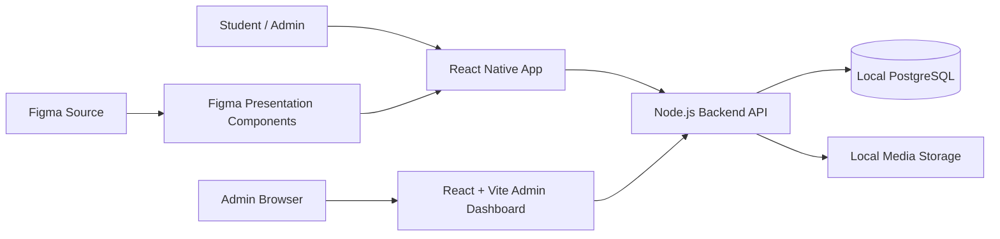

# دليل شرح ومناقشة مشروع CSCApp

> هذا الملف مخصص للتحضير للمناقشة. المعلومات أدناه مرتبطة بالكود الفعلي في المشروع وليست وصفاً نظرياً عاماً.

## 1. ملخص سريع تحفظه قبل المناقشة

**CSCApp** منصة تعلم إلكتروني متكاملة تتكون من:

- تطبيق موبايل للطالب مبني بـ **React Native CLI** وTypeScript.
- Backend مبني بـ **Node.js + NestJS/Express** ويطبق عقد API موثقاً بـOpenAPI.
- قاعدة بيانات **PostgreSQL محلية** تحفظ المستخدمين، الدورات، التسجيلات، التقدم، الإشعارات، الاشتراكات وغيرها.
- لوحة إدارة ويب مستقلة مبنية بـ **React + Vite**، إضافة إلى واجهة إدارة داخل تطبيق الموبايل.
- واجهة الطالب مأخوذة من ملف Figma الأصلي، بينما البيانات والعمليات تأتي من الـBackend الحقيقي عبر API.

الجملة الأفضل لافتتاح المناقشة:

> المشروع منصة تعليم إلكتروني كاملة تفصل بين طبقة العرض وطبقة منطق العمل. تصميم الطالب مأخوذ من Figma، وكل البيانات الديناميكية مثل الحسابات والدورات والتسجيل والتقدم تأتي من Backend حقيقي متصل بقاعدة PostgreSQL محلية.

---

## 2. التقنيات المستخدمة

| الجزء | التقنية | وظيفتها |
|---|---|---|
| تطبيق الموبايل | React Native 0.87 + React 19 + TypeScript | واجهة الطالب والإدارة على Android/iOS |
| تصميم الواجهة | Figma + ملفات التصميم المفككة + React Native SVG | المحافظة على القياسات والصور والألوان الأصلية |
| الاتصال بالخادم | Fetch API داخل `src/services/api.ts` | إرسال الطلبات وإدارة الجلسة وتجديد الـtoken |
| تشغيل الفيديو | `react-native-video` | تشغيل دروس الفيديو وإرسال أحداث التقدم |
| Backend | Node.js + NestJS + Express + TypeScript | تنفيذ منطق النظام والـAPI |
| توثيق وفحص API | OpenAPI + AJV | تعريف الـendpoints والتحقق من المدخلات |
| قاعدة البيانات | PostgreSQL | التخزين الدائم للبيانات والعلاقات |
| كلمات المرور | Argon2id | تخزين كلمات المرور بشكل hash آمن |
| لوحة الإدارة | React + Vite | إدارة المحتوى والمستخدمين من المتصفح |
| الاختبارات | Jest للواجهة وNode Test Runner للخلفية | التأكد من السلوك ومنع تراجع الوظائف |

---

## 3. المعمارية العامة



المشروع يعتمد مبدأ **فصل المسؤوليات**:

- مكونات Figma مسؤولة عن الشكل، القياسات، الألوان، الصور والتنقل المرئي.
- `StudentApp` مسؤول عن ربط الشاشات بالبيانات الحقيقية وإدارة حالة الطالب.
- `api.ts` مسؤول عن التواصل مع الخادم والجلسة والأخطاء.
- الـBackend مسؤول عن المصادقة والصلاحيات وقواعد العمل والحفظ في قاعدة البيانات.

لا تعتمد شاشة الطالب بعد تسجيل الدخول على بيانات Figma الوهمية. يتم حقن بيانات المستخدم والدورات والتقدم الفعلية داخل نفس القالب البصري.

---

## 4. ماذا يحدث عند تشغيل التطبيق؟

نقطة الدخول الأساسية هي:

`frontend/src/App.tsx`

الدالة `SessionApp()` تقرأ المستخدم الحالي بواسطة `useSessionUser()` ثم تقرر الواجهة:

```text
لا توجد جلسة              -> LearningApp (Welcome / Login / Sign up)
جلسة ودور المستخدم student -> StudentApp (واجهة الطالب المتصلة بالـAPI)
جلسة ودور المستخدم admin   -> AdminApp (إدارة الموبايل)
```

هذا يمنع وجود نظامي تنقل منفصلين للطالب بعد الدخول ويحافظ على وصول المدير إلى لوحة الإدارة.

---

## 5. أهم مجلدات المشروع

| المسار | المحتوى |
|---|---|
| `frontend/` | تطبيق React Native للطالب والإدارة |
| `frontend/src/learning/` | شاشات الطالب الديناميكية ومكونات Figma والمشغل |
| `frontend/src/design/` | بيانات الشاشات المفككة من Figma وأنواعها |
| `frontend/design/` | أدوات فك التصميم، التحقق، ولقطات الشاشات المرجعية |
| `frontend/src/assets/` | الخطوط والصور والموارد المستخدمة داخل التطبيق |
| `frontend/src/services/` | طبقة الاتصال بالـAPI وإدارة تحميل البيانات |
| `frontend/src/admin/` | لوحة الإدارة داخل تطبيق الموبايل |
| `backendCSC/` | الخادم، منطق النظام، قاعدة البيانات والاختبارات |
| `backendCSC/contracts/` | عقد OpenAPI الذي يعرّف الـendpoints والطلبات والاستجابات |
| `backendCSC/database/` | migrations التي تنشئ جداول قاعدة البيانات |
| `backendCSC/assets/` | صور أغلفة الدورات والفيديوهات المحلية |
| `admin-dashboard/` | لوحة إدارة الويب المستقلة |
| `docs/` | توثيق المشروع والتشغيل والـAPI |

---

## 6. أهم ملفات الـFrontend

### `frontend/src/App.tsx`

أهم ملف توجيه في تطبيق الموبايل.

- `App()`: يغلف التطبيق بـ`SafeAreaProvider` ويشغل `SessionApp`.
- `SessionApp()`: يحدد هل تظهر واجهة الضيف أو الطالب أو المدير حسب الجلسة والدور.
- `LearningApp()`: يعرض شاشات Figma العامة مثل البداية، التسجيل، تسجيل الدخول والاشتراك.
- `authenticate()`: يربط حقول تسجيل الدخول/التسجيل بطلبات المصادقة الحقيقية.

### `frontend/src/learning/StudentApp.tsx`

الحاوية الأساسية لتجربة الطالب بعد الدخول.

- `StudentApp()`: يمسك route الحالي والتنقل ويربط الشاشات بالمستخدم الحقيقي.
- `Catalog()`: يجلب قائمة الدورات والتصنيفات ويطبق البحث والتصفية.
- `Details()`: يعرض تفاصيل دورة حقيقية، المنهج، حالة التسجيل والإتاحة.
- `CoursePlayer()`: يفتح الدرس المختار ويربط الفيديو بأحداث التقدم.
- `Profile()`: يعرض بيانات المستخدم الفعلية وروابط الحساب.
- `AccountSettings()`: تعديل بيانات الحساب والإعدادات عبر API.
- `Certificates()`: يجلب شهادات الطالب من الخادم.
- `Notifications()`: يجلب الإشعارات الحقيقية ويسمح بتعليمها كمقروءة.
- `Action()`: زر تنفيذ عملية API مع حالات loading وerror وsuccess.

### `frontend/src/learning/FigmaHome.tsx`

- `Home()`: واجهة الصفحة الرئيسية المطابقة لقالب Figma.
- تستقبل `profile` و`notifications` وعمليات التنقل كـprops.
- تعرض الاسم الحقيقي، التصنيفات والدورات القادمة من الخادم.

### `frontend/src/learning/FigmaUI.tsx`

مكتبة مكونات العرض المشتركة المستخرجة من التصميم:

- `node()`: يعيد عقدة محددة من شاشة Figma.
- `adapt()`: ينسخ عقدة تصميم ويطبق تعديلات ديناميكية عليها.
- `DesignText()`: يعرض نصاً ديناميكياً بأسلوب النص الأصلي.
- `textSlots()`: يستبدل النصوص الثابتة بقيم حقيقية.
- `Fragment()`: يرسم جزءاً من مشهد Figma مع replacements وactions.
- `StudentLayout()`: الهيكل العام للشاشة والتنقل والقائمة.
- `CourseCard()`: بطاقة دورة تستقبل بيانات Course حقيقية.
- `Categories()`: تصنيفات قابلة للاختيار.
- `SearchField()`: حقل البحث المطابق للتصميم.
- `CurriculumCard()`: بطاقة فصل/درس وحالته وإمكانية فتحه.

### `frontend/src/learning/Playback.tsx`

- `Playback()`: مشغل فيديو React Native الحقيقي.
- `PlaybackQueue.push()`: يضيف أحداث play/pause/seek/progress إلى الطابور.
- `PlaybackQueue.flush()`: يرسل الأحداث المتراكمة إلى الخادم.
- `PlaybackQueue.stop()`: يوقف المؤقت وينظف الطابور عند إغلاق المشغل.

استخدام الطابور يقلل عدد الطلبات ولا يفقد التقدم عند تغير حالة التشغيل.

### `frontend/src/services/api.ts`

هذا أهم ملف اتصال في الواجهة:

- `API_ORIGIN`: يحدد عنوان الخادم؛ Android Emulator يستخدم `10.0.2.2` للوصول إلى جهاز التطوير.
- `api<T>()`: الدالة العامة لجميع طلبات الـAPI.
- `request()`: يضيف headers والـtoken ويتعامل مع الاستجابة والأخطاء.
- `signIn()`: يسجل الدخول ويحفظ session المستخدم في الذاكرة.
- `signOut()`: يلغي جلسة الخادم وينظف جلسة الواجهة.
- `useSessionUser()`: hook يعيد المستخدم الحالي ويحدث الواجهة عند تغير الجلسة.
- `mediaUrl()`: يحول مسار الصورة/الفيديو القادم من الخادم إلى URL صالح على الجهاز.
- `requestId()`: يولد معرفاً فريداً لتتبع الطلب ومنع الالتباس.

إذا انتهى access token، تحاول الطبقة تجديده باستخدام refresh token ثم تعيد الطلب، وهذا يجعل الجلسة مستمرة بدون مطالبة المستخدم بالدخول كل عدة دقائق.

### `frontend/src/services/useData.ts`

- `useData<T>()`: hook موحد لجلب البيانات.
- يعيد `data`, `loading`, `error`, و`reload`.
- يمنع تكرار منطق التحميل والأخطاء في كل شاشة.

### `frontend/src/design/DesignScene.tsx`

المحرك الذي يرسم شجرة التصميم المفككة من Figma. يقرأ العقد، الصور، النصوص والمواضع، ثم يحولها إلى عناصر React Native/SVG.

### `frontend/src/design/screens.json`

بيانات الشاشات المفككة من ملف Figma الأصلي. يحتوي على الشجرة البصرية والقياسات اللازمة للرسم. هو مرجع تصميم وليس قاعدة بيانات مستخدم أو دورات.

---

## 7. شاشات Figma الموجودة في المشروع

تم التحقق من وجود 18 إطاراً رئيسياً:

1. Splash
2. Welcome
3. Onboarding 1
4. Onboarding 2
5. Onboarding 3
6. Login
7. Sign up
8. Home
9. Search Course
10. Course Details
11. My Courses
12. Profile
13. Subscription Plans
14. Payment
15. Payment Success
16. Course Playing
17. Navigation
18. حالات/نسخ مرتبطة بتدفق الدخول والتطبيق

صور أغلفة الدورات مصدرها أصول Figma نفسها، وتوجد النسخ التي يخدمها الـBackend داخل:

`backendCSC/assets/course-covers/`

الفكرة المهمة في المناقشة: **شكل البطاقة من Figma، لكن عنوان الدورة والسعر والمدرب والتقدم والصورة المرجعة تأتي من الـAPI وقاعدة البيانات.**

---

## 8. أهم ملفات الـBackend

### `backendCSC/src/app.ts`

نقطة تجميع وتشغيل الـBackend.

- `Runtime.constructor()`: يقرأ عقد OpenAPI ويبني validators باستخدام AJV.
- `Runtime.handlers()`: يجمع handlers الخاصة بالمصادقة، الكتالوج، التعلم، الوسائط، الدفع، الإشعارات والإدارة.
- `Runtime.handle()`: المسار المركزي لكل طلب؛ يطبق التحقق، المصادقة، الدور، rate limiting، idempotency وتوحيد الأخطاء.
- `createRuntime()`: ينشئ config والاتصال بقاعدة البيانات والخدمات.
- `createApp()`: ينشئ تطبيق NestJS/Express ويربط المسارات وSwagger والوسائط.

### `backendCSC/src/auth.ts`

مسؤول عن الحسابات والجلسات.

- `authHandlers()`: يجمع handlers للتسجيل، الدخول، التجديد، الخروج، استعادة الحساب وغيرها.
- `authenticate()`: يتحقق من bearer token ويعيد المستخدم والجلسة الصحيحة.
- `session()`: يصدر access/refresh tokens ويسجل الجلسة في قاعدة البيانات.
- `issueEmail()`: ينشئ رموز رسائل التحقق/الاستعادة.
- `social()`: منطق Google/Apple عند توفير إعداداتهما.

كلمات المرور لا تحفظ كنص عادي؛ يتم تخزين hash باستخدام Argon2id.

### `backendCSC/src/catalog.ts`

مسؤول عن الدورات والمكتبة والتسجيل:

- `courseRows()`: يجلب الدورات مع معلومات الحفظ والتسجيل حسب المستخدم.
- `courseSummary()`: يحول صفوف قاعدة البيانات إلى نموذج Course مناسب للـAPI.
- `course()`: يجلب دورة محددة ونسختها المنشورة.
- `canAccess()`: يحدد هل يحق للمستخدم مشاهدة المحتوى أو الشهادة.
- `library()`: يجلب دورات الطالب أو سجل التعلم.
- `catalogHandlers()`: endpoints التصنيفات، home، البحث، التفاصيل، الحفظ، التسجيل والنشر الإداري.
- `notify()`: ينشئ إشعاراً للمستخدم ويحفظه.

### `backendCSC/src/learning.ts`

مسؤول عن تشغيل الدروس وحساب التقدم.

- `mergeRanges()`: يدمج فترات الفيديو المشاهدة لمنع احتساب نفس الثواني أكثر من مرة.
- `learningHandlers()`: بدء جلسة تشغيل، استقبال الأحداث، تحديث التقدم وإكمال الدرس.

هذه نقطة قوية للمناقشة: التقدم لا يعتمد فقط على قيمة يرسلها الهاتف، بل يحسب الخادم الفترات المشاهدة ويثبت النتيجة.

### `backendCSC/src/media.ts`

مسؤول عن الصور والفيديو والتحميل:

- `Storage.write/read/remove()`: عمليات التخزين المحلية أو المزود المحدد.
- `Storage.signedDownload()`: إنشاء رابط مؤقت وآمن للمحتوى.
- `mediaHandlers()`: إنشاء جلسات رفع والتحقق من النوع والحجم والـchecksum.
- `processVideo()`: معالجة الفيديو وتحضير HLS عند الحاجة.
- `mountMedia()`: ربط endpoints تنزيل الصور وتشغيل الفيديو مع Express.
- `assetView()`: شكل بيانات الأصل الذي يعاد للواجهة.

### `backendCSC/src/admin.ts`

- `adminHandlers()`: overview، إدارة المستخدمين، دليل البيانات، الكتالوج وسجل التدقيق.
- الوصول يتطلب مستخدماً دوره بالضبط `admin`.

### `backendCSC/src/core.ts`

الخدمات الأساسية المشتركة:

- `loadConfig()`: قراءة إعدادات البيئة.
- `connect()`: الاتصال بـPostgreSQL.
- `migrate()`: تطبيق ملفات migrations.
- `fail()` و`need()`: أخطاء API موحدة وفحص الشروط.
- `hash()`, `seal()`, `unseal()`: hash وتشفير القيم الحساسة.
- `limit()`: rate limiting.
- `idempotent()`: منع تكرار العملية الحساسة عند إعادة نفس الطلب.
- `audit()`: تسجيل العمليات الإدارية المهمة.
- `paginate()`: تقسيم النتائج إلى صفحات.

### `backendCSC/src/seed.ts`

- `seed()`: يضيف بيانات العرض المحلية: حساب مدير، حساب طالب، تصنيفات، مدربين، دورات، خطط وصور Figma.
- يعمل بشكل منظم لتجهيز بيئة المناقشة المحلية، ولا يعني أن الواجهة تستخدم بيانات hardcoded.
- بعد الـseed تصبح البيانات صفوفاً حقيقية في PostgreSQL وتصل للواجهة من API.

### `backendCSC/contracts/openapi.json`

المصدر الرسمي لعقد الـAPI: أسماء المسارات، request bodies، response schemas، متطلبات المصادقة والأدوار. Swagger متاح محلياً عند تشغيل الخادم على:

`http://127.0.0.1:3000/docs/`

---

## 9. قاعدة البيانات والعلاقات الأساسية

ملفات الإنشاء:

- `backendCSC/database/001_initial.sql`
- `backendCSC/database/002_runtime.sql`

أهم الجداول:

| الجدول/المجموعة | ما يتم تخزينه |
|---|---|
| `users` | الحساب، الاسم، البريد، الدور والحالة |
| `auth_sessions` | جلسات الدخول وrefresh tokens |
| `categories` | تصنيفات الدورات |
| `instructors` | بيانات المدربين |
| `courses` و`course_versions` | بيانات الدورة والنسخة المنشورة/المسودة |
| `chapters` و`lessons` | منهج الدورة وترتيب الدروس |
| `media_assets` | الصور والفيديو والملفات المرفوعة |
| `enrollments` | تسجيل الطالب في الدورة |
| `bookmarks` | الدورات المحفوظة |
| `playback_sessions/events` | جلسات وأحداث تشغيل الفيديو |
| `lesson_progress` | التقدم المؤكد لكل درس |
| `certificates` | الشهادات الناتجة عن إكمال الدورة |
| `notifications` | إشعارات المستخدم |
| `plans` و`subscriptions` | خطط واشتراكات الطالب |
| جداول الدفع | محاولات ونتائج الدفع حسب المزود |
| `outbox_events` | أحداث الخلفية التي يجب تنفيذها بأمان |
| `idempotency_keys` | منع تكرار العمليات |
| `audit_logs` | سجل العمليات الإدارية الحساسة |

علاقة مبسطة:

```text
User -> Enrollments -> Courses -> Course Versions -> Chapters -> Lessons
User -> Playback Sessions/Events -> Lesson Progress -> Certificates
User -> Bookmarks
User -> Notifications
User -> Subscription -> Plan -> Plan Courses
Course -> Instructor + Category + Media Assets
```

---

## 10. أهم تدفقات النظام

### التسجيل Sign up

1. المستخدم يملأ الاسم والبريد وكلمة المرور في شاشة Figma.
2. `LearningApp.authenticate(true)` يستدعي endpoint التسجيل.
3. الخادم يتحقق من شكل البيانات حسب OpenAPI.
4. يتحقق من عدم تكرار البريد.
5. يحفظ hash كلمة المرور بواسطة Argon2id.
6. ينشئ session وaccess/refresh tokens.
7. تعاد بيانات المستخدم للواجهة.
8. `SessionApp` يلاحظ وجود المستخدم وينقل إلى `StudentApp`.

### تسجيل الدخول Sign in

1. `signIn(email, password)` يرسل بيانات الدخول للـBackend.
2. الخادم يبحث عن المستخدم ويتحقق من password hash.
3. ينشئ جلسة مسجلة في قاعدة البيانات.
4. يحفظ frontend الجلسة ويحدث `useSessionUser()`.
5. إذا كان الدور `admin` تظهر `AdminApp`، وإلا تظهر `StudentApp`.

### فتح الصفحة الرئيسية

1. `StudentApp` يطلب بيانات home/profile/notifications بواسطة `useData` و`api`.
2. `catalogHandlers()` يجلب البيانات من PostgreSQL.
3. تعاد البيانات كـJSON حسب عقد OpenAPI.
4. `FigmaHome` يضع القيم الحقيقية داخل القالب البصري الأصلي.

### التسجيل في دورة ومشاهدة درس

1. الطالب يفتح `Details` لدورة حقيقية.
2. يطلب التسجيل أو يبدأ الدورة.
3. الخادم ينشئ/يحدث `enrollment` ويتحقق من صلاحية الوصول.
4. `CoursePlayer` يفتح الدرس المسموح.
5. `PlaybackQueue` يرسل play/pause/seek/progress.
6. الخادم يدمج الفترات المشاهدة ويحدث `lesson_progress`.
7. شاشة My Courses تعرض النسبة المؤكدة من الخادم.

### إدارة دورة

1. المدير يدخل لوحة الويب أو `AdminApp`.
2. ينشئ draft للدورة ويرفع الغلاف/الفيديو.
3. `media.ts` يتحقق من الملف ويحفظه.
4. عند النشر، يصبح الإصدار المنشور متاحاً للطالب.
5. كل عملية مهمة تمر بفحص role ويمكن تسجيلها في `audit_logs`.

---

## 11. المصادقة والأمان

- Password hashing باستخدام Argon2id.
- Access token قصير العمر وrefresh token لتجديد الجلسة.
- تدوير refresh tokens والكشف عن إعادة استخدام token قديم.
- Role based access control؛ عمليات الإدارة تتطلب `admin`.
- فحص كل body/path/query/header بواسطة OpenAPI + AJV.
- Rate limiting لحماية المسارات الحساسة.
- Idempotency للعمليات التي لا يجب أن تتكرر عند إعادة الطلب.
- Signed URLs وروابط محدودة العمر لبعض ملفات الفيديو والشهادات.
- فحص MIME والحجم والchecksum عند رفع الملفات.
- Audit logs للعمليات الإدارية.
- رسائل خطأ موحدة مع request ID لتسهيل التتبع.

---

## 12. لوحة الإدارة وطريقة الدخول

يوجد نوعان من واجهة الإدارة:

1. إدارة داخل تطبيق الموبايل: `frontend/src/admin/AdminApp.tsx`.
2. لوحة ويب مستقلة: `admin-dashboard/src/App.tsx`.

رابط لوحة الويب المحلية:

`http://127.0.0.1:5173/admin/`

شرط الدخول: يجب أن يكون حقل `role` للمستخدم هو `admin`.

يوجد حساب مدير محلي تم إنشاؤه بواسطة seed. البريد الافتراضي المحلي:

`admin@salford.test`

كلمة المرور لا تُكتب في هذا الدليل حتى لا تظهر عند مشاركة الملف. اقرأها من الملف المحلي الخاص:

`backendCSC/.local/local-app/demo-accounts.json`

ثم:

1. تأكد أن Backend يعمل على port 3000.
2. افتح `http://127.0.0.1:5173/admin/`.
3. أدخل بريد المدير وكلمة المرور من الملف الخاص.
4. الخادم يتحقق من الحساب ومن أن الدور `admin` قبل السماح بعمليات الإدارة.

لا تغيّر role مباشرة بشكل عشوائي في قاعدة البيانات. الطريقة الآمنة هي استخدام seed للبيئة المحلية أو endpoint إداري محمي إذا كان مدير موجوداً.

---

## 13. التشغيل المحلي

### Backend

من مجلد `backendCSC`:

```powershell
npm run dev
```

أوامر مفيدة:

```powershell
npm run migrate
npm run seed
npm run typecheck
npm test
npm run check:contract
```

### تطبيق Android

من مجلد `frontend`:

```powershell
npm run android:dev
```

المشروع مضبوط لاستخدام Metro على port **8082**. لا تشغل Metro أو emulator ثانياً إذا كانا يعملان.

أوامر الفحص:

```powershell
adb devices
npm run typecheck
npm test -- --runInBand
npm run lint
```

### لوحة الإدارة

من مجلد `admin-dashboard`:

```powershell
npm run dev
```

ثم افتح `/admin/` على عنوان Vite الظاهر، وعادة يكون port 5173.

---

## 14. سيناريو عرض المشروع في المناقشة

مدة مناسبة: 6 إلى 8 دقائق.

1. ابدأ بشاشة Welcome واذكر أن الواجهة مبنية من مرجع Figma الأصلي.
2. أنشئ حساب طالب جديد لتثبت أن Sign up حقيقي.
3. سجل الخروج ثم ادخل بالحساب نفسه لتثبت Sign in والجلسات.
4. افتح Home واشرح أن الاسم والدورات والصور تأتي من API.
5. استخدم Search وافتح Course Details.
6. سجل في دورة وافتح درساً وشغّل الفيديو.
7. ارجع إلى My Courses وأظهر تقدم الطالب.
8. افتح Profile وNotifications.
9. افتح Swagger بسرعة لعرض توثيق الـAPI.
10. افتح لوحة الإدارة وسجل بحساب admin المحلي.
11. اعرض دورة أو مستخدماً واشرح role based authorization.
12. اختم بمخطط المعمارية: React Native/Web -> API -> PostgreSQL/Media.

لا تبدأ بشرح كل ملف. اعرض رحلة مستخدم كاملة أولاً، ثم اشرح البنية عندما يسأل المناقش.

---

## 15. أسئلة متوقعة مع إجابات مختصرة

### 1. ما فكرة المشروع؟

منصة تعلم إلكتروني تسمح للطالب بإنشاء حساب، تصفح الدورات، التسجيل، تشغيل الدروس، حفظ التقدم واستقبال الإشعارات، وتسمح للمدير بإدارة المحتوى والمستخدمين.

### 2. لماذا استخدمت React Native CLI؟

لإنشاء تطبيق أصلي لـAndroid/iOS مع تحكم مباشر في إعدادات native وتشغيل الفيديو والملفات، مع مشاركة معظم كود TypeScript.

### 3. هل واجهة Figma مجرد صور ثابتة؟

لا. التصميم يوفر البنية البصرية والمواضع، لكن النصوص، الدورات، الصور، التقدم والأزرار مرتبطة بحالة React وبيانات API حقيقية.

### 4. كيف ربطتم Figma بالبيانات؟

مكونات مثل `Fragment`, `DesignText`, و`CourseCard` تحافظ على أسلوب التصميم وتقبل replacements وprops قادمة من `StudentApp` وAPI.

### 5. أين يتم تحديد واجهة الطالب أو المدير؟

في `SessionApp()` داخل `frontend/src/App.tsx`. إذا كان `user.role === 'admin'` يعرض `AdminApp`، وإذا كان هناك مستخدم عادي يعرض `StudentApp`.

### 6. أين تحفظ بيانات المستخدم؟

في PostgreSQL. الواجهة لا تحفظ قاعدة مستخدمين محلية؛ هي ترسل الطلبات للـBackend.

### 7. كيف تُحفظ كلمة المرور؟

كـArgon2id hash مع salt، ولا يمكن استرجاع النص الأصلي منها.

### 8. ما الفرق بين access token وrefresh token؟

Access token يستخدم للطلبات وعمره أقصر. Refresh token يستخدم لإصدار جلسة وصول جديدة بدون تسجيل الدخول من جديد، ويتم تدويره لحماية الجلسة.

### 9. كيف تمنعون الطالب من فتح endpoint إداري؟

الخادم يقرأ متطلبات الدور من عقد العملية ويتحقق من الجلسة والدور قبل تشغيل handler. إخفاء الزر في الواجهة وحده ليس حماية.

### 10. لماذا استخدمتم OpenAPI؟

ليكون هناك عقد واضح بين الواجهة والخلفية، ولتوثيق المسارات والتحقق آلياً من المدخلات والاستجابات وتقليل أخطاء التكامل.

### 11. ما وظيفة AJV؟

يحوّل JSON Schema في OpenAPI إلى validators سريعة تفحص body وquery وpath وheaders قبل تنفيذ منطق العملية.

### 12. كيف يعمل البحث؟

الواجهة ترسل query/filter إلى endpoint الكتالوج، والخادم يستعلم من بيانات الدورات المنشورة ثم يعيد النتائج وفق schema موحد.

### 13. كيف تحسبون تقدم الفيديو؟

الهاتف يرسل أحداث تشغيل، والخادم يدمج الفترات المشاهدة بواسطة `mergeRanges` ويخزن تقدماً مؤكداً، بدلاً من الثقة بنسبة يرسلها العميل مباشرة.

### 14. ماذا يحدث إذا انقطع الإنترنت أثناء الفيديو؟

`PlaybackQueue` يجمع الأحداث ويحاول إرسالها على دفعات. تبقى آخر قيمة مؤكدة في الخادم هي المصدر الرسمي للتقدم.

### 15. كيف تصل صور Figma إلى التطبيق؟

أصول الصور الأصلية موجودة في المشروع، وتم وضع أغلفة الدورات في media assets على الخادم. الـAPI يعيد مساراتها و`mediaUrl()` يجعلها قابلة للعرض على emulator.

### 16. لماذا يستخدم Android العنوان 10.0.2.2؟

لأن `127.0.0.1` داخل emulator يشير إلى emulator نفسه، بينما `10.0.2.2` هو العنوان الخاص للوصول إلى localhost في جهاز Windows المضيف.

### 17. ما الفرق بين draft وpublished course version؟

المدير يعدل draft بدون التأثير على النسخة التي يراها الطلاب. عند النشر تصبح النسخة المحددة هي النسخة الفعالة في الكتالوج.

### 18. كيف تمنعون تكرار الدفع أو التسجيل بسبب إعادة الطلب؟

باستخدام idempotency key؛ نفس العملية بنفس المفتاح تعيد النتيجة السابقة ولا تنفذ مرتين.

### 19. هل الدفع حقيقي الآن؟

بيئة العرض المحلية تعمل بوضع demo، لذلك لا تسحب مالاً حقيقياً. البنية تدعم providers، لكن تفعيل الدفع الحقيقي يحتاج مفاتيح وwebhooks وإعداد بيئة إنتاج.

### 20. هل Google وApple Sign-In يعملان؟

Google Sign-In منفذ على Android بواسطة `@react-native-google-signin/google-signin` ومربوط بالـBackend وجلسة التحدي أحادية الاستخدام. تشغيله بحساب حقيقي يحتاج Android/Web OAuth Client IDs من Google Cloud وحساب Google على الجهاز؛ استخدم `docs/GOOGLE_SIGN_IN_SETUP_AR.md`. Apple ما زال يحتاج SDK وcredentials خاصة به. الدخول والتسجيل بالبريد وكلمة المرور متحققان محلياً بالكامل.

### 21. كيف تتعاملون مع الأخطاء؟

الخادم يعيد أخطاء موحدة مع code وmessage وrequest ID. `ApiError` في الواجهة يحولها إلى رسائل مفهومة، وتعرض الشاشات loading/error/retry.

### 22. ما فائدة request ID؟

يربط طلب المستخدم بسجل الخادم، فيسهل تتبع الخطأ في logs بدون تخمين.

### 23. لماذا توجد لوحة إدارة ويب وأخرى داخل الموبايل؟

كلاهما يستهلك نفس API المحمي. الويب أنسب لإدارة المحتوى على شاشة كبيرة، والموبايل يثبت أن التوجيه حسب الدور يعمل داخل التطبيق أيضاً.

### 24. كيف تولد الشهادات؟

بعد تحقق شروط الإكمال ينشئ الخادم حدثاً/مهمة خلفية، يتم توليد ملف الشهادة وحفظه كأصل ثم يعاد رابط آمن للطالب.

### 25. ما أصعب جزء في المشروع؟

دمج تصميم Figma الدقيق مع بيانات ديناميكية حقيقية بدون الرجوع إلى واجهة ثابتة، والمحافظة في الوقت نفسه على المصادقة، الصلاحيات، التسجيل والتقدم.

### 26. كيف اختبرتم النظام؟

تم استخدام typecheck، اختبارات frontend وbackend، lint، contract checks، وتجارب فعلية لتسجيل الدخول وإنشاء حساب وتشغيل التطبيق على Android emulator.

### 27. ماذا ستطور لاحقاً؟

يمكن تفعيل مزود دفع إنتاجي، OAuth بمفاتيح رسمية، تخزين S3/CDN، push notifications حقيقية، واختبارات end-to-end على أجهزة متعددة.

### 28. هل البيانات الوهمية ما زالت في الواجهة؟

بيانات التصميم الثابتة تستخدم فقط كمرجع بصري. بيانات الحسابات والدورات والتسجيلات والتقدم تأتي من API. بيانات seed هي بيانات تجريبية حقيقية محفوظة في قاعدة التطوير، وليست arrays hardcoded داخل الشاشات.

---

## 16. نقاط يجب ألا تجيب عنها بشكل خاطئ

- لا تقل إن الدفع يسحب مالاً حقيقياً؛ الوضع المحلي Demo.
- لا تقل إن Google/Apple جاهزان بدون إعداد؛ يحتاجان credentials خارجية.
- لا تقل إن إخفاء أزرار المدير هو الحماية؛ الحماية الحقيقية في الـBackend.
- لا تقل إن Figma هو قاعدة البيانات؛ هو مصدر العرض فقط.
- لا تقل إن التقدم يحسب في الهاتف فقط؛ الخادم يؤكد ويحفظ التقدم.
- لا تعرض كلمة مرور حساب المدير على شاشة عامة؛ افتحها من الملف المحلي عند الحاجة فقط.
- لا تعد بأن التطبيق يعمل دون Backend؛ الوظائف الديناميكية تعتمد على API وقاعدة البيانات.

---

## 17. حالة التحقق الحالية

آخر تحقق للمشروع شمل:

- اختبارات Frontend: **59/59 ناجحة**.
- اختبارات Backend: **33/33 ناجحة**.
- TypeScript typecheck ناجح للواجهة والخلفية ولوحة الإدارة.
- Lint بدون errors؛ توجد warnings أسلوبية لا تمنع التشغيل.
- Sign in وSign up تم اختبارهما فعلياً مع الـBackend وقاعدة البيانات.
- صور أغلفة الدورات مطابقة لملفات Figma المصدرية بواسطة hash.
- Android emulator يعمل على `emulator-5554`.
- Metro يستخدم port `8082`.
- Backend يستخدم port `3000`.
- Admin dashboard يستخدم port `5173`.

> إذا أعدت تشغيل الجهاز، افحص الخدمات مرة أخرى قبل العرض؛ نجاح التحقق السابق لا يعني أن العمليات ستبقى شغالة بعد restart.

---

## 18. مراجعة سريعة خلال دقيقة واحدة

احفظ هذه النقاط:

1. `App.tsx / SessionApp` يقرر Guest أو Student أو Admin.
2. `StudentApp` منطق الطالب، و`FigmaUI` طبقة العرض.
3. `api.ts` يدير الطلبات والجلسة وتجديد token.
4. `app.ts / Runtime.handle` بوابة جميع طلبات الخادم.
5. `auth.ts` للمصادقة، `catalog.ts` للدورات، `learning.ts` للتقدم، `media.ts` للملفات، `admin.ts` للإدارة.
6. PostgreSQL هو مصدر البيانات الحقيقي.
7. OpenAPI هو عقد التكامل والتحقق.
8. دور `admin` مطلوب من الخادم، وليس من الواجهة فقط.
9. عنوان Backend من Android emulator هو `10.0.2.2:3000`.
10. التصميم من Figma، والبيانات من API.
