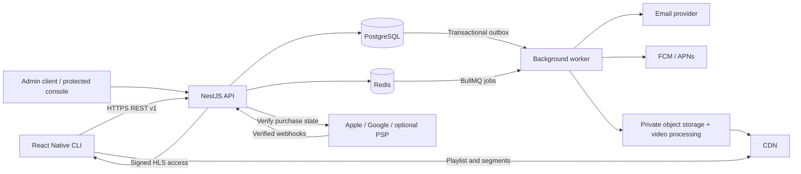
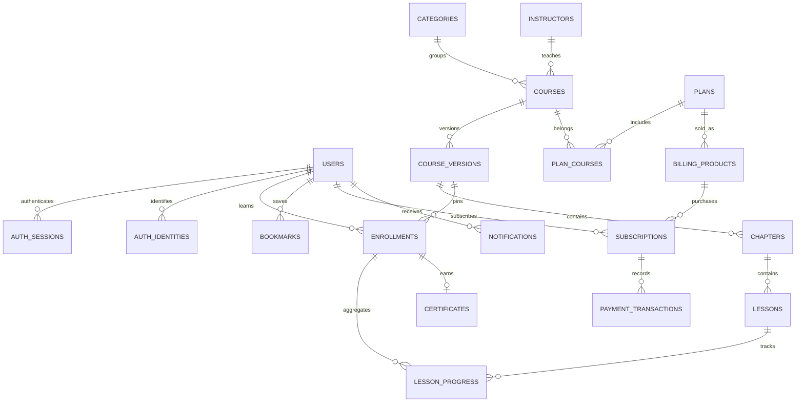
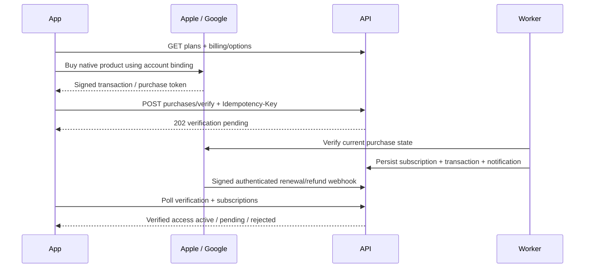

# هيكلة الباك إند وقواعد النظام

## 1. القرار المعماري

نقترح modular monolith: تطبيق NestJS واحد وworker من نفس المستودع. كل مجال يملك services وrepositories؛ لا يقرأ Controller جداول مجال آخر مباشرة. Nest يوفر feature modules وحدودًا واضحة للـproviders؛ اختيار هذه البنية هنا نابع من حجم التطبيق الحالي، وليس شرطًا من Figma. [Nest modules](https://docs.nestjs.com/modules)



REST كافٍ لهذه الشاشات. لا حاجة إلى WebSocket؛ polling محدود لحالة الدفع وتجهيز الشهادة، وpush لتنبيه المستخدم.

## 2. هيكل التنفيذ المقترح

الشجرة التالية **اقتراح تاريخي قبل التنفيذ**؛ الهيكل الفعلي موضح في [دليل السيرفر](../../../backendCSC/README.md). هذا المرجع ليس مجلد تشغيل آخر:

```text
backend/
  src/
    main.ts
    app.module.ts
    config/                 # typed env validation; secrets injected by runtime
    common/
      auth/                 # JWT guard, current-user, recent-auth, role guard
      errors/               # global error mapping + requestId
      validation/           # strict DTOs, limits, cursor decoding
      idempotency/          # request hash + atomic result storage
    database/
      database.module.ts    # pool + scoped transaction client
      migrations/
    modules/
      auth/                 # password, sessions, email tokens, provider adapters
      users/                # profile, settings, deletion
      catalog/              # categories, instructors, courses, immutable versions
      learning/             # enrollment, playback, progress, history
      bookmarks/
      billing/              # plans, products, provider receipts, entitlements
      certificates/
      notifications/        # inbox + device tokens
      media/                # upload policy + processing + signed stream URLs
      admin/                # protected publishing workflows; no public admin signup
      health/
    workers/
      worker.main.ts
      outbox.worker.ts
      email.worker.ts
      media.worker.ts
      billing.worker.ts
      certificates.worker.ts
      push.worker.ts
      deletion.worker.ts
  test/                     # API integration + permission + provider sandbox tests
  database/schema.sql       # reference schema supplied in this design
  openapi.json              # proposed HTTP contract supplied in this design
```

داخل كل module: `*.controller.ts` لتحويل HTTP، `*.service.ts` لقواعد المجال والtransactions، `*.repository.ts` لاستعلامات SQL، `dto/` للمدخلات والمخرجات، و`*.spec.ts` لاختبارات السلوك. حساب Entitlements مركزي داخل billing ويستدعيه learning؛ لا تتكرر شروط وصول متباينة في الشاشات.

PostgreSQL مصدر الحقيقة. Redis ليس مصدر الاشتراك أو التقدم؛ يستخدم caching قصير الأجل، throttling وطوابير BullMQ. العامل يستقبل jobs قابلة لإعادة المحاولة، ويحتفظ outbox بالأحداث إلى أن تُرسل. [Nest queues](https://docs.nestjs.com/techniques/queues)

## 3. قاعدة البيانات

العلاقات التفصيلية والقيود موجودة في `database/schema.sql`. `uuid` مستقل عن frame IDs وعن hashes الصور المحلية. كل timestamps من نوع `timestamptz`؛ السعر عدد صحيح بأصغر وحدة عملة ولا يستخدم float.



| المجموعة | الجداول | قواعد أساسية |
|---|---|---|
| الهوية | users, auth_identities, auth_sessions, auth_challenges | بريد موحّد case insensitive؛ unique(provider,subject)؛ refresh hashes؛ tokens أحادية الاستخدام |
| الملف | user_settings, account_deletions | فصل تفضيل push عن إذن الجهاز؛ دورة حذف يمكن مراقبتها |
| المحتوى | categories, instructors, media_assets, courses, course_versions, chapters, lessons | نسخة منشورة ثابتة؛ ترتيب فريد؛ lesson يتبع نفس version الخاص بفصله |
| التعلم | enrollments, lesson_progress, playback_sessions, playback_events, bookmarks | unique enrollment للحساب/النسخة؛ FK مركبة تمنع تقدم طالب أو نسخة أخرى |
| التجارة | plans, plan_courses, billing_products, billing_customers, subscriptions, purchase_verifications, payment_transactions, checkout_sessions | خريطة منتجات متجر؛ دليل شراء لا ينسب لحسابين؛ لا PAN أو CVV |
| الشهادة | certificates | شهادة واحدة لكل enrollment؛ نسخة الاسم والعنوان ثابتة؛ public code عشوائي |
| الرسائل | notifications, device_tokens | deduplication، token لجهاز/حساب حالي، رسالة بلا بيانات حساسة في push |
| الموثوقية | webhook_events, outbox_events, idempotency_keys, audit_logs | inbox/outbox دائم؛ حالات إعادة المحاولة؛ سجل إدارة دون أسرار |

السجل لا يُحذف عشوائيًا بـCASCADE. عامل حذف الحساب يزيل البيانات الخاصة وفق سياسة احتفاظ معتمدة، ويُجهّل بيانات المستخدم في السجلات التي يلزم الاحتفاظ بها؛ لا يُفترض أن جميع السجلات التجارية يمكن حذفها فورًا. يلغى نشر تحقق الشهادات ويُحذف PDF عند حذف صاحبه وفق السياسة المختارة. الاحتفاظ القانوني النهائي يحتاج مراجعة حسب بلد النشاط.

قواعد لا يكفي FK لتنفيذها: عدم تعديل version منشورة، مدة الدرس المطابقة للملف المعالج، وجود required lesson قبل النشر، صحة provider/environment، نطاق مشاهدة صحيح، صلاحيات المستخدم وبيانات شراء معتمدة. هذه تنفذ داخل services وتحتاج اختبارات تكامل.

## 4. العقد والأخطاء

`Authorization: Bearer <accessToken>`؛ المستخدم مشتق من الجلسة. لا يقبل endpoint حسابي `userId` يحدده العميل. JSON نجاح: `{"data": ...}`. قائمة: `{"data":{"items":[],"nextCursor":null}}`. DELETE/PUT الناجح بلا محتوى يعيد 204.

```json
{
  "error": {
    "code": "SUBSCRIPTION_REQUIRED",
    "message": "Choose an eligible subscription to watch this lesson.",
    "requestId": "49d13422-8f81-47db-b52d-1c3d1f778675"
  }
}
```

| HTTP | أمثلة codes | تصرف العميل |
|---|---|---|
| 400 / 422 | VALIDATION_ERROR, INVALID_CURSOR | إبراز الحقل، لا إعادة محاولة تلقائية |
| 401 | INVALID_CREDENTIALS, TOKEN_EXPIRED, SESSION_REVOKED | refresh مرة واحدة عند token expiry؛ لا refresh loop |
| 403 | EMAIL_NOT_VERIFIED, SUBSCRIPTION_REQUIRED, CHANNEL_NOT_ALLOWED | عرض إجراء مناسب، لا فتح المحتوى |
| 404 | RESOURCE_NOT_FOUND | لا يكشف وجود مورد مملوك لحساب آخر |
| 409 | IDEMPOTENCY_CONFLICT, PURCHASE_ALREADY_LINKED, CERTIFICATE_NOT_READY, PLAYBACK_SESSION_EXPIRED | إعادة جلب الحالة أو بدء session جديدة حسب code |
| 429 | RATE_LIMITED | احترام Retry-After |
| 503 | PROVIDER_UNAVAILABLE, SERVICE_UNAVAILABLE | retry بتأخير، مع الحفاظ على حالة pending |

pagination بحد افتراضي20 وأقصى100؛ cursor مربوط بالfilters/sort وتاريخ+id أو rank+id. البحث يشمل المدرس عبر join، مع full-text للعنوان والوصف، وparameterized matching للأسماء عند الحاجة؛ لا Elasticsearch في البداية. منطق trending/popular: إكمال/التحاق حقيقي مجمّع لنافذة محددة، ويمكن استخدام featuredRank عند قلة البيانات؛ لا أرقام تسويق وهمية.

## 5. المصادقة والجلسات

- كلمة المرور تُخزن Argon2id، مع ضبط cost بقياس بيئة التشغيل؛ لا تشفير قابل للاسترجاع ولا logs. سياسة التصميم 12–128 حرفًا، بينما الواجهة الحالية 8؛ يجب توحيدهما عند التنفيذ. [OWASP password storage](https://cheatsheetseries.owasp.org/cheatsheets/Password_Storage_Cheat_Sheet.html)
- access JWT قصير: 10 دقائق مقترحة. refresh عشوائي opaque، hash فقط بقاعدة البيانات. Remember Me: أقصى30 يومًا، وإلا24 ساعة؛ هذه سياسة مقترحة قابلة للضبط وليست متطلبًا في Figma.
- rotation داخل transaction مع row lock: استهلاك القديم، إنشاء الجديد، ربط family. replay يلغي family. refresh عند العميل single-flight؛ إعادة token مستهلك بعد ضياع الرد تتطلب login بدل تخفيف الحماية.
- JWT يحمل sub/session family/auth_time/iss/aud/exp. التحقق يثبت algorithm allowlist ومفتاحًا موثوقًا؛ لا يقبل alg=none أو يختار مفتاحًا من URL غير موثوق. يتحقق Guard من حالة الحساب والجلسة لضمان الخروج والحذف فورًا؛ أي cache للإلغاء قصيرة جدًا مع invalidation. refresh لا يغير auth_time. تغيير البريد والحذف وlogout-all يحتاج تسجيل دخول حديثًا خلال5 دقائق، بpassword أو provider sign-in جديد.
- reset/verification tokens قصيرة العمر، عشوائية، محفوظة hashed، استعمال واحد داخل transaction. روابط HTTPS عبر verified App Links/Universal Links؛ لا تستعمل `salford://preview` التجريبي. إعادة تعيين كلمة المرور تلغي الجلسات كلها. رسائل طلب/reset/register عامة لتقليل كشف الحسابات.
- Google/Apple: SDK حقيقي، ثم السيرفر يتحقق من JWT الخاص بالمزوّد: signature/issuer/audience/expiry/nonce، ويربط الهوية بـsubject. **لا ربط تلقائي لمجرد تطابق البريد**. تضارب البريد يتطلب تسجيل الدخول للحساب الموجود، والربط المتقدم مؤجل. [Google backend verification](https://developers.google.com/identity/sign-in/android/backend-auth)، [Apple user verification](https://developer.apple.com/documentation/signinwithapple/verifying-a-user)
- challenge قصير5 دقائق ويرتبط بالinstallation/provider؛ nonce عشوائي يستعمل مرة واحدة ويجب أن يدخل طلب SDK ويرجع داخل الهوية الموقعة. اختر SDK يدعم ذلك. إذا استُخدم تدفق browser بدل SDK فيجب تصميم authorization-code + PKCE مع state/nonce وredirect allowlist؛ لا WebView ولا client secret داخل التطبيق. [RFC 8252](https://www.rfc-editor.org/rfc/rfc8252)
- OAuth-only users ليس لديهم password hash؛ إعادة المصادقة لهم عبر مزوّدهم. Apple code exchange/revocation يحتاج مفاتيح server-side وحفظ provider refresh token مشفرًا في auth_identities عند الحاجة. رمز idToken وحده لا يُخزن كجلسة دائمة.
- role=student فقط عند signup. bootstrap admin يدوي آمن، ثم إدارة عبر SSO/MFA أو ingress موثوق قبل الإنتاج؛ لا حقل role مفتوح في public request. كل مسار admin محمي ومراجع بسجل audit.

## 6. الدورات والوصول والتقدم

القاعدة: `canAccess = course.free OR verifiedActiveSubscriptionCoversCourse` مع التأكد من status وفترة الصلاحية والبيئة والحساب. وجود bookmark أو enrollment لا يكفي للوصول المدفوع. preview يسمح بالفيديو المحدد فقط دون منح شهادة. My Courses يبقى ظاهرًا بعد انتهاء الاشتراك مع access=false والتقدم محفوظ.

الاشتراك يغطي plan_courses صراحةً؛ لا نفترض أن Basic/Pro/Premium متدرجة أو تشمل الجميع. لا يسمح تعديل coverage/ميزات عقد خطة أثناء وجود فترة مدفوعة فعالة؛ يعاد409 وتُنشأ خطة/نسخة شروط جديدة. الترقية والتخفيض تتم عبر المزوّد، مع قواعد renewal/proration تراجع عند التنفيذ. لا تُعطى فترة وصول بعد expired/on_hold/revoked، وgrace تُمنح فقط إلى نهاية grace مثبتة من المزوّد.

```mermaid
sequenceDiagram
  participant App as React Native
  participant API as API
  participant DB as Database
  participant CDN as Private CDN
  App->>API: POST course/enrollments
  API->>DB: Check entitlement; create/get enrollment
  App->>API: POST lesson/playback-sessions
  API->>DB: Verify owner + version + access
  API-->>App: sessionId + signed HLS + resume position
  App->>CDN: Load authorized playlist and segments
  App->>API: Heartbeat eventId + sequence + position
  API->>DB: Validate + merge coverage + update aggregate + outbox
  API-->>App: Authoritative lesson/course progress
```

ملف الفيديو خاص. لا يمر المحتوى الثقيل داخل Nest؛ API يصدر grant قصيرًا (5 دقائق مقترحة) يجيز playlist وsegments وليس manifest وحده. عند expiry أو403 يبدأ العميل playback-session جديدة مع آخر موضع مؤكد. هذا يمنع الوصول الطويل بعد إلغاء اشتراك، لكنه ليس DRM ولا منعًا تامًا لتسجيل الشاشة.

heartbeats كل15 ثانية مقترحة، وعند pause/end. eventId فريد وsequence متزايد لكل session. السيرفر يرفض replay مختلف المحتوى، ويتجاهل تكرار نفس الحدث. يعالج كل batch داخل transaction، ويقفل session ثم lesson_progress ثم enrollment بترتيب ثابت. يشمل إنشاء outbox للإكمال في نفس transaction. معاملات pg يجب أن تستخدم client واحدًا من البداية للنهاية. [node-postgres transactions](https://node-postgres.com/features/transactions)

لا يقبل السيرفر `completed=true` أو نسبة من العميل. يحسب intervals بين heartbeats بشرط توافق مقدار تقدم الفيديو مع الزمن المنقضي الفعلي وplaybackRate المسموح (0.5–2) وهامش صغير؛ seek لا يضيف الجزء المتجاوز. الزمن الكبير بعد انقطاع غير موثق لا يُحسب. تُدمج intervals دون ازدواجية، وتقص إلى مدة الفيديو المؤكدة. lastPosition للحفظ منفصل عن watchedSeconds.

سياسة v1 المقترحة: الدرس مكتمل بعد مشاهدة95% من مدته المعتمدة؛ الدورة مكتملة بعد إكمال جميع required lessons لنسخة enrollment. نسبة الدورة = متوسط نسب التغطية المقيدة100% بعد تقسيم كل درس على حد95%، موزونة بمدة الدرس. الاختبارات تثبت ألا تنشأ شهادة من onEnd وحده. القياس على عميل غير موثوق لا يثبت تعلمًا حقيقيًا أو يمنع كل التلاعب؛ لا يُستخدم وحده لاعتماد رسمي.

نسخة course منشورة لا تتغير. نشر تعديل ينشئ version جديدة؛ الطالب الحالي يبقى على القديمة وشهادته مرتبطة بها. catalog يعرض المنشورة الأحدث؛ curriculum يقبل versionId قديمة فقط لصاحب enrollment. منع/سحب محتوى قانونيًا عملية إدارية خاصة، وليست مجرد archive من البحث.

## 7. الشراء والتحقق

**مسار v1 المفضل للنشر: Apple In-App Purchase وGoogle Play Billing.** شروط المحتوى الرقمي والاستثناءات تختلف حسب storefront وبرامج المزوّد؛ لا يحق استنتاج أن Visa/PayPal/Google Pay المرسومة مسموحة في كل توزيع. نقطة external checkout معطلة افتراضيًا، وGoogle Pay ليس Google Play Billing. [Apple payment guidelines](https://developer.apple.com/app-store/review/guidelines/#in-app-purchase)، [Google Play payments policy](https://support.google.com/googleplay/android-developer/answer/9858738?hl=en)



التحقق يشمل product mapping، package/bundle id، sandbox/production، expiry، refund/revocation، appAccountToken أو obfuscatedAccountId المربوط بالمستخدم. evidenceHash فريد ومخزن مع نسخة مشفرة عند الحاجة لإعادة التحقق. Google purchaseToken والاعتراف بالشراء (acknowledgement) يعالجان من backend مع retries؛ لا يُعطى وصول لعملية pending. [Google billing security](https://developer.android.com/google/play/billing/security)

عدم وصول webhook لا يمنع verification الأولية من الاستعلام عن المزوّد؛ reconciliation دوري يعالج الأحداث المفقودة وتواريخ الانتهاء. webhooks تتحقق من التوقيع قبل حفظ inbox، ثم ACK بعد الحفظ الدائم وتنفذ async. Apple: JWS، Google Pub/Sub: OIDC والجمهور وحساب الخدمة، Stripe عند تفعيله: raw bytes + signature. اختلاف ترتيب الأحداث لا يرجع الاشتراك إلى حالة قديمة؛ أعد جلب الحالة من المزوّد. [Stripe webhook ordering and signatures](https://docs.stripe.com/webhooks)

subscription status: pending → active/grace/on_hold/expired/revoked. `cancelAtPeriodEnd` منفصل عن status: الإلغاء قد يبقي الوصول إلى نهاية الفترة. refund لا يُفسر موحدًا دون حالة entitlement المزوّد. restore يتحقق من نفس الدليل، يعيد الاشتراك لصاحبه فقط، ويرفض ربطه بحساب آخر.

لا تفترض unique active subscription واحدة على مستوى DB لأن المستخدم قد يشتري من متجرين. الواجهة تحذّر من اشتراك قائم وتوجه لإدارته؛ السيرفر يحتفظ بكل السجلات ويجمع الوصول بشكل واضح دون إسقاط أحدها أو مضاعفة الشحن بنفس idempotency key. بيانات البطاقات لا تصل API/DB/logs؛ hosted checkout اختياري بمزوّد متاح لبلد التاجر بعد اعتماده، وليس التزامًا باستخدام Stripe تحديدًا.

## 8. الشهادات والإشعارات والإدارة

عند إكمال كل الدروس المطلوبة، ينشئ worker شهادة واحدة إذا كان course.certificate_enabled=true وتسمح سياسة الخطة في وقت الإكمال؛ free course يحتاج فقط تفعيل الشهادة صراحةً على الدورة. يثبت قرار الأهلية داخل outbox transaction وقت الإكمال، فلا يغيره تأخر worker أو انتهاء الاشتراك لاحقًا. يحفظ snapshot للاسم والعنوان، يولد PDF في تخزين خاص، ثم notification. لا يقدم API `issueCertificate` للطالب. مشاركة publicCode متوقفة افتراضيًا حتى opt-in، بلا بريد أو UUID حساب، مع rate limit. revoked يمنع التحميل والتحقق.

Inbox هو السجل الدائم، وpush مجرد إشارة. learningNotifications=false يوقف push التعليمي، لا يحذف Inbox ولا يلغي رسائل الأمان الضرورية. إذن نظام الهاتف مستقل؛ token يتبدل ويتحدث عند الدخول والتجديد ويحذف عند الخروج. worker يحذف tokens غير الصالحة، ولا يضع تفاصيل حسابية حساسة في lock-screen payload.

CMS ضروري لإدخال المحتوى؛ لا يلزم تطبيق admin موبايل. admin APIs في العقد تكفي لمسار: category/instructor → upload → complete/process → draft curriculum → publish → map plan products. uploads بمفاتيح عشوائية وحد أقصى وحصص وchecksum/MIME فحص فعلي؛ لا تُقبل روابط فيديو arbitrary server-fetch. قيم حجم مقترحة: صورة5MB، فيديو2GB مع multipart إذا احتاج مزود التخزين؛ العقد الحالي single upload session ويجب توسعته قبل رفع ملفات تتجاوز حدود المزود.

## 9. الأمان والتشغيل

- حماية كل مورد بـowner scope في الاستعلام نفسه، ومراجعة IDOR. JWT لا يغني عن authorization. SQL parameterized، DTO whitelist، body limits، لا raw SQL من مدخل المستخدم.
- rate limits مقترحة: login5/دقيقة لكل IP+email مع backoff؛ reset3/ساعة لكل email مع IP cap؛ catalog120/دقيقة؛ progress20/دقيقة لكل session مع batch cap20. تُضبط بقياس الواقع، لا كبديل لتدابير منع الإساءة.
- TLS إلزامي إنتاجيًا. access token في الذاكرة وrefresh في Keychain/Keystore، لا AsyncStorage. مفاتيح DB/JWT/OAuth/provider/object storage في secret manager، ليست `.env` داخل bundle. إخفاء tokens/passwords/purchase evidence عن logs وtraces.
- فصل development/staging/production وحسابات sandbox عن real billing؛ أي evidence sandbox لا يفتح production. DB role للتطبيق بأقل صلاحيات، وrole migrations منفصل. الشبكة لا تكشف PostgreSQL/Redis للعامة.
- outbox workers يعيدون المحاولة بـexponential backoff؛ dead-letter بعد حد معلوم؛ dedupe على receipt/event/certificate/notification. Billing webhook failures لها alert وreconciliation؛ لا يضيع الحدث بسبب تعطل Redis بعد commit.
- migrations بإجراء expand/contract ونسخ احتياطي قبل تغييرات حساسة؛ DB backups يومية + point-in-time recovery حسب خطة الاستضافة، واختبار استرجاع دوري. goals أولية RPO15 دقيقة وRTO4 ساعات تحتاج تحقق من مزود الاستضافة قبل التعهد بها.
- قياس p95 API latency ومعدل أخطاء الدخول وتأخر webhooks/jobs وفشل الفيديو/الرسائل. logs مهيكلة مع requestId، readiness يحجب المرور إذا فقدت تبعيات لازمة. health لا يكشف بيانات حساسة.
- الـSQL المرفق لا ينشئ RLS أو network policies أو runtime roles؛ ليس تأمينًا تلقائيًا لقاعدة مكشوفة. authorization يبدأ بالخدمات وrepositories ويختبر من خلال HTTP قبل الإنتاج.

## 10. إعدادات بيئة التنفيذ المطلوبة

| المجموعة | الإعدادات |
|---|---|
| Core | NODE_ENV, PORT, PUBLIC_API_ORIGIN, DATABASE_URL, REDIS_URL |
| Auth | JWT_SIGNING_KEY + rotation key ids, TOKEN_HASH_PEPPER, Google audiences, Apple team/key/client IDs ومفتاح خاص |
| Email | مزوّد SMTP/API key، عنوان مرسل موثق، AUTH_LINK_ORIGIN allowlist |
| Media | endpoint/bucket/region/credentials، CDN signing keys، allowed upload limits |
| Billing | bundleId/packageName، Apple server credentials، Google service account، Pub/Sub audience، BILLING_ENVIRONMENT |
| Optional PSP | EXTERNAL_CHECKOUT_ENABLED=false افتراضيًا، credentials/webhook secret، allowlisted redirect origins |
| Notifications | FCM credentials وAPNs إعدادات المشروع |
| Ops | log redaction، error monitoring DSN، limits، admin ingress/SSO |

لا توجد قيم أسرار في هذا التصميم ولا حاجة لطلبها أثناء التحليل. ينبغي اختيار المزوّدين وحسابات المتاجر ومحتوى الدورات قبل تنفيذ اختبارات إنتاج حقيقية.
